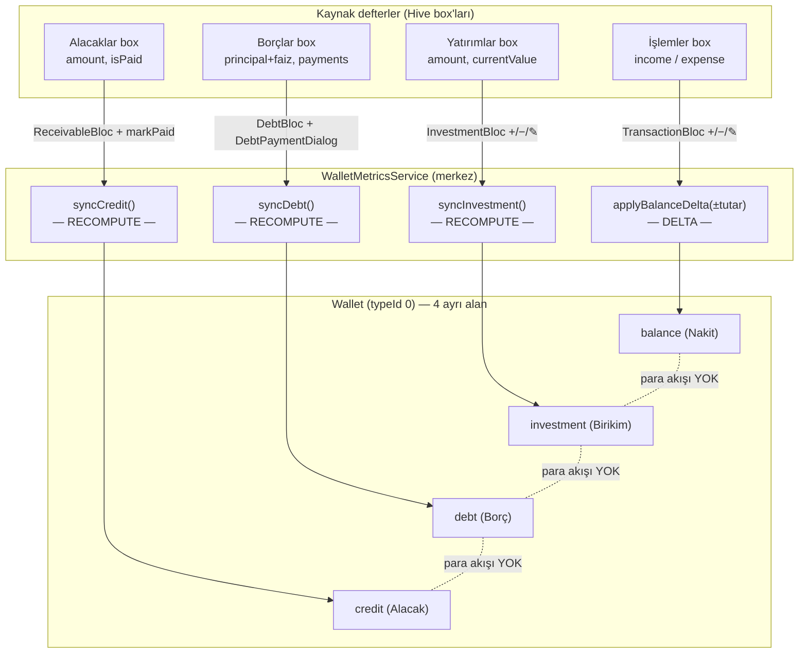

# CuNehat — Para Akışı / "Hesap-Kitap" Zinciri
### Algoritma + Görselleştirme + Mantık Hataları

## Amaç
Bir cüzdan oluşturulduğunda; **nakit (balance)**, **birikim/yatırım**, **borç** ve **alacak** rakamlarının nasıl hesaplandığını ve birbirine nasıl bağlandığını koddan birebir izleyip belgelemek. Sonunda zinciri görselleştirip mantık hatalarını işaretlemek. Tüm tespitler `dosya:satır` kanıtlıdır.

---

## 1. Cüzdan veri modeli — **4 bağımsız "defter"**
`WalletEntity` (`lib/features/wallet/domain/entities/wallet_entity.dart:3-30`) içinde 4 para alanı var:

| Alan | UI etiketi | Anlamı | Hive alanı |
|---|---|---|---|
| `balance` | (kart başlığı) | **Nakit** bakiye | `wallet_model.dart` HiveField 3 |
| `investment` | "Birikim" | Yatırımların toplamı | HiveField 6 (`json: 'save'`) |
| `credit` | "Alacak" | Tahsil edilecek alacaklar | HiveField 5 |
| `debt` | "Borç" | Kalan borçlar | HiveField 4 |

Bu 4 alan kartta **ayrı ayrı** gösteriliyor (`wallet_card_widget.dart:74-82` nakit; `:146-151` Birikim/Alacak/Borç chip'leri). **Hiçbir yerde tek bir "net değer/toplam varlık" hesabında birleştirilmiyorlar** (grep: net-worth toplaması yok).

---

## 2. Cüzdan oluşturma akışı
1. Form → `CreateWalletEvent` → `WalletBloc` (`wallet_bloc.dart:88-107`).
2. `createWalletUseCase` → `WalletRepositoryImpl.createWallet` → `WalletLocalDataSource.createWallet` (`wallet_local_datasource.dart:26-32`): cüzdanı `wallets` box'ına `put(id, wallet)`.
3. Ardından `setActiveWalletUseCase` → `users` box'ında `activeWalletId` set edilir (`wallet_local_datasource.dart:68-80`).
4. `getWallets`/`watchWallets`, `isActive`'i `activeWalletId` ile **dinamik** üretir (`wallet_local_datasource.dart:60-62`).

Cüzdan oluşturulurken `balance/debt/credit/investment` formdan ne girildiyse o değerle başlar; sonrasında aşağıdaki 4 ayrı mekanizmayla güncellenir.

---

## 3. Güncelleme algoritmaları — merkez: `WalletMetricsService`
`lib/core/services/wallet_metrics_service.dart` 4 işlemle tüm zincirin merkezindedir. **Kritik nokta: `balance` artımlı (delta), diğer 3'ü yeniden-hesaplama (recompute) ile güncellenir.**

### 3.1 `balance` ← İşlemler (delta tabanlı)
- Tetikleyici: `TransactionBloc` Ekle/Güncelle/Sil (`transaction_bloc.dart:68-148`).
- İşaretli tutar: `isIncome ? +amount : -amount` (`:150-152`).
- Ekle: `delta = +signed(yeni)` (`:78-81`)
- Güncelle: `delta = signed(yeni) − signed(eski)` (`:103-107`)
- Sil: `delta = −signed(silinen)` (`:132-135`)
- Uygulama: `applyBalanceDelta` → `balance = balance + delta` (`wallet_metrics_service.dart:21-31`).
- ⚠️ **Yeniden hesaplama yolu YOK** (grep: `syncBalance`/`initialBalance` yok).

### 3.2 `investment` ← Yatırımlar (recompute)
- Tetikleyici: `InvestmentBloc` Ekle/Güncelle/Sil → `_safeSyncInvestment` (`investment_bloc.dart:56,72,88,97-103`).
- Hesap: `wallet.investment = Σ investment.currentValue` (`wallet_metrics_service.dart:61-82`).
- ✅ Recompute → kendini düzeltir.

### 3.3 `debt` ← Borçlar (recompute)
- Tetikleyici: `DebtBloc` Ekle/Güncelle/Sil → `_safeSyncDebt` (`debt_bloc.dart:48,63,77,86-92`). Ödeme: `DebtPaymentDialog` yeni `Payment` ekler → `UpdateDebtEvent` → `syncDebt` (`debt_payment_dialog.dart:51-72`).
- Borç matematiği (`debt_entity.dart:97-104`): `totalDebtAmount = principal + principal*faiz*ay/1200`; `remainingAmount = totalDebtAmount − Σpayments`.
- Hesap: `wallet.debt = Σ remainingAmount` (**tüm** borçlar, `isPaid` filtresi YOK) (`wallet_metrics_service.dart:33-44`).

### 3.4 `credit` ← Alacaklar (recompute)
- Tetikleyici: `ReceivableBloc` Ekle/Güncelle/Sil/Ödendi → `_safeSyncCredit` (`receivable_bloc.dart:52,66,80,96,106-112`).
- Hesap: `wallet.credit = Σ amount` (**yalnız `!isPaid`** alacaklar) (`wallet_metrics_service.dart:46-59`).
- Alacakta kısmi ödeme yok; sadece `isPaid` bool (`receivable_entity.dart:1-20`).

---

## 4. Görselleştirme

### 4.1 Zincir diyagramı (Mermaid)


### 4.2 Özet tablo
| Defter | Kaynak | Güncelleme stratejisi | Nakit (`balance`) ile kuplaj? |
|---|---|---|---|
| balance | İşlemler | **Delta** (artımlı) | — |
| investment | Yatırımlar | Recompute (Σ currentValue) | ❌ yok |
| debt | Borçlar | Recompute (Σ remaining, **filtre yok**) | ❌ yok |
| credit | Alacaklar | Recompute (Σ amount, **!isPaid**) | ❌ yok |

### 4.3 ASCII şema (terminal için)
```
                 ┌───────────────── WalletMetricsService ─────────────────┐
 İşlemler  ─────▶│ applyBalanceDelta(±)  ── DELTA ──▶  Wallet.balance      │
 Yatırımlar ────▶│ syncInvestment() ── RECOMPUTE ──▶  Wallet.investment    │
 Borçlar ──────▶│ syncDebt()       ── RECOMPUTE ──▶  Wallet.debt          │
 Alacaklar ────▶│ syncCredit()     ── RECOMPUTE ──▶  Wallet.credit        │
                 └────────────────────────────────────────────────────────┘
   balance  ⇎  investment  ⇎  debt  ⇎  credit   (aralarında para akışı YOK)
```

---

## 5. Zincirdeki Mantık Hataları / Riskler

### L1 [Yüksek etkili — tasarım] Dört defter tamamen kopuk; nakit ↔ borç/yatırım/alacak akışı yok
**Kanıt:** `grep` — `lib/features/investments` ve `lib/features/debt_and_receivable` içinde `AddTransactionEvent / TransactionBloc / applyBalanceDelta` **hiç geçmiyor**. Bloklar yalnız `sync*` çağırıyor.
**Sonuç:**
- Yatırım eklersen `investment` artar, `balance` düşmez → yatırımı neyle aldığın kayıtsız.
- Borç ödersen (`DebtPaymentDialog`) `debt` düşer, `balance` düşmez → nakit çıkışı görünmez.
- Borç alırsan `debt` artar, `balance` artmaz → eline geçen nakit görünmez.
- Alacağı tahsil edince `credit` düşer, `balance` artmaz → giren para görünmez.
**Değerlendirme:** 4 alan toplanıp tek "net varlık" gösterilmediği için ekranda doğrudan yanlış sayı **çıkmıyor** (bu iyi). Ama defterler iç tutarlı değil: kullanıcı nakdi kafasında birleştirirse yanılır. **İki yol:** (a) Kopukluğu kasıtlı kabul et ve UI'da "bunlar bağımsız takip kalemleridir, toplanmaz" notu/etiketi ekle; **veya** (b) çift-taraflı kuplaj kur: borç ödemesi → otomatik gider işlemi, borç alma → gelir işlemi, yatırım alımı → gider işlemi, alacak tahsili → gelir işlemi (opsiyonel ayar).

### L2 [Orta] `balance` yalnız delta ile güncelleniyor → kalıcı sapma (drift) riski
**Kanıt:** `applyBalanceDelta` `balance + delta` yapıyor (`wallet_metrics_service.dart:29`); recompute yolu yok (grep boş). Delta kaybı noktaları: `applyBalanceDelta` cüzdan null'da **sessiz return** (`:27`); `transaction_bloc._safeApplyBalanceDelta` exception'ı **yutuyor** (`transaction_bloc.dart:163-165`).
**Sonuç:** Tek bir kaçan/yutulan delta → `balance` gerçek işlem toplamından kalıcı sapar; diğer 3 defterin aksine kendini düzeltemez.
**Öneri:** `syncBalance` ekle (`balance = başlangıç + Σ signedAmount(işlemler)`) ya da bakiyeyi türetilmiş değer yap.

### L3 [Orta] Borç ve Alacak sync'i tutarsız kriter kullanıyor
**Kanıt:** `syncDebt` **tüm** borçların `remainingAmount`'unu topluyor, `isPaid` filtresi yok (`wallet_metrics_service.dart:38-39`). `syncCredit` ise **yalnız `!isPaid`** alacakların tam `amount`'unu topluyor (`:52-54`).
**Sonuç:** Bir borç `isPaid=true` ama `remainingAmount>0` ise (manuel "ödendi" işaretleme / yuvarlama) hâlâ `debt`'e eklenir → borç abartılır. İki taraf simetrik değil (borçta kısmi ödeme var, alacakta yok).
**Öneri:** İki tarafta da aynı kuralı uygula; borçta da gerekiyorsa `isPaid` / `remainingAmount<=0` olanları dışla.

### L4 [Orta] Yatırım "toplam"ı iki yerde iki farklı tanım
**Kanıt:** Kart "Birikim" = `Σ currentValue` (güncel değer, `wallet_metrics_service.dart:74`). Yatırım ekranı `InvestmentLoaded.totalAmount` = `Σ amount` (maliyet/anapara, `investment_bloc.dart:42`).
**Sonuç:** Aynı kavram iki ekranda farklı sayı gösterir (güncel değer vs maliyet) → kafa karışıklığı.
**Öneri:** İkisini netle ayır ("Maliyet" vs "Güncel Değer") veya tek tanımda birleştir.

### L5 [Düşük] Cüzdan silinince bağlı veriler temizlenmiyor
**Kanıt:** `deleteWallet` yalnız wallet kaydını ve `activeWalletId`'yi siliyor (`wallet_local_datasource.dart:34-50`); işlemler/borçlar/alacaklar/yatırımlar box'larında `walletId`'ye bağlı kayıtlar yetim kalıyor.
**Sonuç:** Veri çöplüğü; silinen cüzdana ait `sync*` çağrıları `getWalletById==null` ile sessizce no-op olur.
**Öneri:** Cüzdan silmede ilişkili kayıtları da temizle (cascade).

### L6 [Düşük] Ölü kod: `WalletLocalDataSource.updateBalance/updateDebt/updateCredit/updateInvestment`
**Kanıt:** Bu `(userId, double)` imzalı yardımcılar (`wallet_local_datasource.dart:132-162`) hiçbir yerden çağrılmıyor; metrics service bunları **baypas** edip `getWalletById + copyWith + updateWallet` kullanıyor.
**Öneri:** Kafa karışıklığını önlemek için kaldır.

---

## 6. Özet
- **Mimari:** Cüzdan = 4 bağımsız defter. `balance` **delta**, diğer 3'ü **recompute**. Merkez: `WalletMetricsService`.
- **Güçlü yön:** Recompute yaklaşımı (debt/credit/investment) kendini düzeltir — sağlam.
- **Ana risk (L1):** Defterler arası **nakit kuplajı yok**; çift-taraflı muhasebe değil. Şu an UI toplam göstermediği için "yoktan para" ekranda çıkmıyor ama iç tutarlılık zayıf.
- **İkincil riskler:** L2 (balance drift), L3 (debt/credit asimetrisi), L4 (yatırım maliyet/değer çiftliği).
- **Öncelik sırası önerisi:** L1 kararı (kuplaj mı, açık etiket mi) → L2 syncBalance → L3 kriter birleştir → L4 etiket netleştir → L5/L6 temizlik.

> Not: Bu belge yalnız analiz/algoritma içindir; kod değişikliği yapılmadı.
